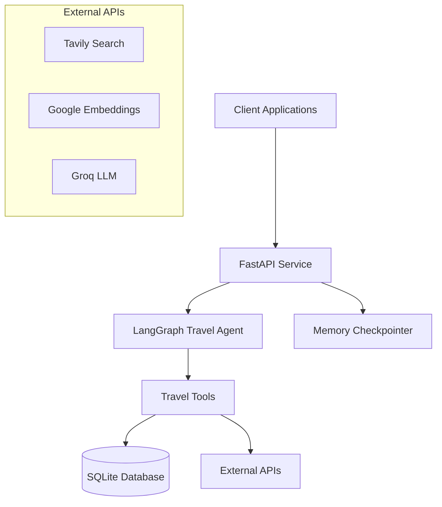

# Design Document

## Overview

The FastAPI Travel Agent service will wrap the existing LangGraph travel booking agent in a REST API, providing HTTP endpoints for chat interactions, conversation management, and service monitoring. The service will maintain the existing agent functionality while adding web service capabilities for integration with client applications.

## Architecture

### High-Level Architecture



### Service Layer Structure

- **FastAPI Application**: Main web service handling HTTP requests/responses
- **Agent Wrapper**: Service layer that manages LangGraph agent interactions
- **Request/Response Models**: Pydantic models for API validation
- **Error Handling**: Centralized exception handling and logging
- **Health Monitoring**: Service health checks and status reporting

## Components and Interfaces

### 1. FastAPI Application (`main.py`)

**Purpose**: Main application entry point and route definitions

**Key Components**:
- FastAPI app initialization with middleware
- Route definitions for chat, health, and management endpoints
- CORS configuration for web client support
- Exception handlers for graceful error responses

### 2. Agent Service (`agent_service.py`)

**Purpose**: Wrapper service for LangGraph agent interactions

**Key Methods**:
```python
class AgentService:
    def __init__(self, graph, memory)
    async def process_message(self, message: str, passenger_id: str, thread_id: str) -> AgentResponse
    async def create_new_thread(self) -> str
    async def get_conversation_history(self, thread_id: str) -> List[Message]
    def health_check(self) -> HealthStatus
```

### 3. Request/Response Models (`models.py`)

**Chat Request Model**:
```python
class ChatRequest(BaseModel):
    message: str
    passenger_id: str
    thread_id: Optional[str] = None
```

**Chat Response Model**:
```python
class ChatResponse(BaseModel):
    response: str
    thread_id: str
    timestamp: datetime
    tool_calls: Optional[List[ToolCall]] = None
```

**Health Response Model**:
```python
class HealthResponse(BaseModel):
    status: str
    database_connected: bool
    agent_ready: bool
    timestamp: datetime
```

### 4. Database Manager (`database.py`)

**Purpose**: Database connection management and health checks

**Key Features**:
- Connection pooling for SQLite database
- Health check queries
- Database initialization and updates
- Error handling for database operations

## Data Models

### Request Models

1. **ChatRequest**: User message with passenger context
2. **NewThreadRequest**: Optional initial message for new conversations
3. **HistoryRequest**: Thread ID for conversation retrieval

### Response Models

1. **ChatResponse**: Agent response with metadata
2. **ThreadResponse**: New thread creation confirmation
3. **HistoryResponse**: List of conversation messages
4. **HealthResponse**: Service status information
5. **ErrorResponse**: Standardized error information

### Internal Models

1. **Message**: Individual conversation message
2. **ToolCall**: Tool execution information
3. **AgentState**: Current agent processing state

## Error Handling

### Error Categories

1. **Validation Errors (400)**:
   - Missing required fields
   - Invalid passenger_id format
   - Malformed request data

2. **Not Found Errors (404)**:
   - Invalid thread_id
   - Non-existent conversation

3. **Service Errors (500)**:
   - Agent processing failures
   - Database connection issues
   - External API failures

4. **Service Unavailable (503)**:
   - Database unavailable
   - Required services down

### Error Response Format

```python
class ErrorResponse(BaseModel):
    error: str
    message: str
    timestamp: datetime
    request_id: Optional[str] = None
```

### Exception Handling Strategy

- Custom exception classes for different error types
- Global exception handler for unhandled errors
- Structured logging for error tracking
- Graceful degradation when possible

## Testing Strategy

### Unit Tests

1. **Agent Service Tests**:
   - Message processing functionality
   - Thread management
   - Error handling scenarios

2. **API Endpoint Tests**:
   - Request validation
   - Response formatting
   - Error responses

3. **Database Tests**:
   - Connection management
   - Health check queries
   - Data persistence

### Integration Tests

1. **End-to-End Chat Flow**:
   - Complete conversation scenarios
   - Tool execution verification
   - Multi-turn conversations

2. **External Service Integration**:
   - Database connectivity
   - LLM API interactions
   - Search API functionality

### Performance Tests

1. **Load Testing**:
   - Concurrent request handling
   - Response time benchmarks
   - Memory usage monitoring

2. **Stress Testing**:
   - High-volume message processing
   - Database connection limits
   - Error recovery testing

## API Endpoints

### Chat Endpoints

- `POST /chat` - Send message to agent
- `POST /chat/new` - Create new conversation thread
- `GET /chat/{thread_id}/history` - Get conversation history

### Management Endpoints

- `GET /health` - Service health check
- `GET /docs` - OpenAPI documentation
- `GET /` - Service information

## Configuration

### Environment Variables

- `GROQ_API_KEY` - Groq LLM API key
- `GOOGLE_API_KEY` - Google Embeddings API key  
- `TAVILY_API_KEY` - Tavily Search API key
- `LANGSMITH_API_KEY` - LangSmith tracing key
- `DATABASE_URL` - SQLite database path
- `LOG_LEVEL` - Logging level (DEBUG, INFO, WARN, ERROR)
- `CORS_ORIGINS` - Allowed CORS origins

### Service Configuration

- Request timeout settings
- Database connection parameters
- Agent processing limits
- Logging configuration

## Security Considerations

1. **Input Validation**: All requests validated using Pydantic models
2. **SQL Injection Prevention**: Parameterized queries only
3. **Rate Limiting**: Consider implementing rate limiting for production
4. **CORS Configuration**: Properly configured allowed origins
5. **Error Information**: Avoid exposing sensitive information in error messages